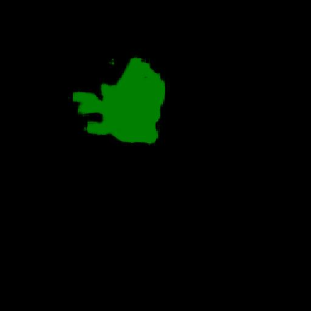

<h2>Tensorflow-Image-Segmentation-Brain-Tumor (2024/11/03)</h2>

This is the second experiment of Image Segmentation for Brain Tumor
 based on 
the latest <a href="https://github.com/sarah-antillia/Tensorflow-Image-Segmentation-API">Tensorflow-Image-Segmentation-API</a>, and
<a href="https://drive.google.com/file/d/102X3nartGSh4X3LCzjSxXW33wRx-TA1P/view?usp=sharing">
LGG-MRI-Brain-Tumor-ImageMask-Dataset.zip</a>, which was derived by us from  
<a href="https://www.kaggle.com/datasets/mateuszbuda/lgg-mri-segmentation">
Brain MRI segmentation
</a>
 
 
Please see also our first experiment 
<a href="https://github.com/atlan-antillia/Image-Segmentation-Brain-Tumor">Image-Segmentation-Brain-Tumor
</a>
 
 
On our dataset, please refer to <a href="https://github.com/sarah-antillia/Augmentation-CDD-CESM-Brain-Tumor-Segmentation-Dataset">
Augmentation-CDD-CESM-Brain-Tumor-Segmentation-Dataset
</a>
 

<b>Actual Image Segmentation for Images of 512x512 pixels</b> 
As shown below, the inferred masks look similar to the ground truth masks.  

<table>
<tr>
<th>Input: image</th>
<th>Mask (ground_truth)</th>
<th>Prediction: inferred_mask</th>
</tr>
<tr>
<td></td>
<td></td>
<td></td>
</tr>

<tr>
<td></td>
<td></td>
<td></td>
</tr>

<tr>
<td></td>
<td></td>
<td></td>
</tr>

</table>

 
In this experiment, we used the simple UNet Model 
<a href="./src/TensorflowUNet.py">TensorflowSlightlyFlexibleUNet</a> for this Brain-TumorSegmentation Model. 
As shown in <a href="https://github.com/sarah-antillia/Tensorflow-Image-Segmentation-API">Tensorflow-Image-Segmentation-API</a>.
you may try other Tensorflow UNet Models: 

<li><a href="./src/TensorflowSwinUNet.py">TensorflowSwinUNet.py</a></li>
<li><a href="./src/TensorflowMultiResUNet.py">TensorflowMultiResUNet.py</a></li>
<li><a href="./src/TensorflowAttentionUNet.py">TensorflowAttentionUNet.py</a></li>
<li><a href="./src/TensorflowEfficientUNet.py">TensorflowEfficientUNet.py</a></li>
<li><a href="./src/TensorflowUNet3Plus.py">TensorflowUNet3Plus.py</a></li>
<li><a href="./src/TensorflowDeepLabV3Plus.py">TensorflowDeepLabV3Plus.py</a></li>

 

<h3>1. Dataset Citation</h3>
The image dataset used here has been taken from the following web site.

<b>Brain MRI segmentation</b> 
<a href="https://www.kaggle.com/datasets/mateuszbuda/lgg-mri-segmentation">
https://www.kaggle.com/datasets/mateuszbuda/lgg-mri-segmentation
</a>
  
<b>About Dataset</b> 
LGG Segmentation Dataset 
Dataset used in: 
Mateusz Buda, AshirbaniSaha, Maciej A. Mazurowski "Association of genomic subtypes of  
lower-grade gliomas with shape features automatically extracted by a deep learning  
algorithm." Computers in Biology and Medicine, 2019. 
and
Maciej A. Mazurowski, Kal Clark, Nicholas M. Czarnek, Parisa Shamsesfandabadi,  
Katherine B. Peters, Ashirbani Saha "Radiogenomics of lower-grade glioma:  
algorithmically-assessed tumor shape is associated with tumor genomic subtypes  
and patient outcomes in a multi-institutional study with  
The Cancer Genome Atlas data." Journal of Neuro-Oncology, 2017. 
 
This dataset contains brain MR images together with manual FLAIR abnormality  
segmentation masks. 
The images were obtained from The Cancer Imaging Archive (TCIA). 
They correspond to 110 patients included in The Cancer Genome Atlas (TCGA)  
lower-grade glioma collection with at least fluid-attenuated inversion recovery (FLAIR)  
sequence and genomic cluster data available. 
Tumor genomic clusters and patient data is provided in data.csv file. 
 

 
<h3>
<a id="2">
2 Brain-TumorImageMask Dataset
</a>
</h3>
 If you would like to train this Brain-TumorSegmentation model by yourself,
 please download the dataset from the google drive 
<a href="https://drive.google.com/file/d/102X3nartGSh4X3LCzjSxXW33wRx-TA1P/view?usp=sharing">
LGG-MRI-Brain-Tumor-ImageMask-Dataset.zip</a>,
, expand the downloaded ImageMaskDataset and put it under <b>./dataset</b> folder to be
<pre>
./dataset
└─Brain-Tumor
    ├─test
    │   ├─images
    │   └─masks
    ├─train
    │   ├─images
    │   └─masks
    └─valid
        ├─images
        └─masks
</pre>

<b>Brain-Tumor Statistics</b> 
 
 
As shown above, the number of images of train and valid datasets is enough to use for a training set of our segmentation model.
 
 
<b>Train_images_sample</b> 

 
<b>Train_masks_sample</b> 

 

<h3>
3 Train TensorflowUNet Model
</h3>
 We have trained Brain-TumorTensorflowUNet Model by using the following
<a href="./projects/TensorflowSlightlyFlexibleUNet/Brain-Tumor/train_eval_infer.config"> <b>train_eval_infer.config</b></a> file.  
Please move to ./projects/TensorflowSlightlyFlexibleUNet/Brain-Tumorand run the following bat file. 
<pre>
>1.train.bat
</pre>
, which simply runs the following command. 
<pre>
>python ../../../src/TensorflowUNetTrainer.py ./train_eval_infer.config
</pre>

<b>Model parameters</b> 
Defined a small <b>base_filters</b> and large <b>base_kernels</b> for the first Conv Layer of Encoder Block of 
<a href="./src/TensorflowUNet.py">TensorflowUNet.py</a> 
and a large num_layers (including a bridge between Encoder and Decoder Blocks).
<pre>
[model]
base_filters   = 16
base_kernels   = (9,9)
num_layers     = 8
</pre>

<b>Learning rate</b> 
Defined a small learning rate.  
<pre>
[model]
learning_rate  = 0.00007
</pre>

<b>Online augmentation</b> 
Disabled our online augmentation.  
<pre>
[model]
model         = "TensorflowUNet"
generator     = False
</pre>

<b>Loss and metrics functions</b> 
Specified "bce_dice_loss" and "dice_coef". 
<pre>
[model]
loss           = "bce_dice_loss"
metrics        = ["dice_coef"]
</pre>
<b>Learning rate reducer callback</b> 
Enabled learing_rate_reducer callback, and a small reducer_patience.
<pre> 
[train]
learning_rate_reducer = True
reducer_factor     = 0.4
reducer_patience   = 4
</pre>

<b>Early stopping callback</b> 
Enabled early stopping callback with patience parameter.
<pre>
[train]
patience      = 10
</pre>

<b>Epoch change inference callbacks</b> 
Enabled epoch_change_infer callback. 
<pre>
[train]
epoch_change_infer       = True
epoch_change_infer_dir   =  "./epoch_change_infer"
epoch_changeinfer        = False
epoch_changeinfer_dir    = "./epoch_changeinfer"
num_infer_images         = 6
</pre>

By using this callback, on every epoch_change, the inference procedure can be called
 for 6 images in <b>mini_test</b> folder. This will help you confirm how the predicted mask changes 
 at each epoch during your training process.    

<b>Epoch_change_inference output</b> 
 
 

In this experiment, the training process was stopped at epoch 84 by EarlyStopping Callback.  
 
 

<a href="./projects/TensorflowSlightlyFlexibleUNet/Brain-Tumor/eval/train_metrics.csv">train_metrics.csv</a> 
 

 
<a href="./projects/TensorflowSlightlyFlexibleUNet/Brain-Tumor/eval/train_losses.csv">train_losses.csv</a> 
 

 

<h3>
4 Evaluation
</h3>
Please move to a <b>./projects/TensorflowSlightlyFlexibleUNet/Brain-Tumor</b> folder, 
and run the following bat file to evaluate TensorflowUNet model for Brain-Tumor. 
<pre>
./2.evaluate.bat
</pre>
This bat file simply runs the following command.
<pre>
python ../../../src/TensorflowUNetEvaluator.py ./train_eval_infer_aug.config
</pre>

Evaluation console output: 

  Image-Segmentation-CDD-CESM-Brain-Tumor

<a href="./projects/TensorflowSlightlyFlexibleUNet/Brain-Tumor/evaluation.csv">evaluation.csv</a> 

The loss (bce_dice_loss) to this Brain-Tumor/test was low, and dice_coef high as shown below.
 
<pre>
loss,0.0629
dice_coef,0.8953
</pre>
 

<h3>
5 Inference
</h3>
Please move to a <b>./projects/TensorflowSlightlyFlexibleUNet/Brain-Tumor</b> folder 
,and run the following bat file to infer segmentation regions for images by the Trained-TensorflowUNet model for Brain-Tumor. 
<pre>
./3.infer.bat
</pre>
This simply runs the following command.
<pre>
python ../../../src/TensorflowUNetInferencer.py ./train_eval_infer_aug.config
</pre>

<b>mini_test_images</b> 
 
<b>mini_test_mask(ground_truth)</b> 
 

<b>Inferred test masks</b> 
 
 

<b>Enlarged images and masks </b> 

<table>
<tr>
<th>Image</th>
<th>Mask (ground_truth)</th>
<th>Inferred-mask</th>
</tr>

<tr>
<td></td>
<td></td>
<td></td>
</tr>

<tr>
<td></td>
<td></td>
<td></td>
</tr>

<tr>
<td></td>
<td></td>
<td></td>
</tr>
<tr>
<td></td>
<td></td>
<td></td>
</tr>
<tr>
<td></td>
<td></td>
<td></td>
</tr>
<tr>
<td></td>
<td></td>
<td></td>
</tr>
</table>

 

<h3>
References
</h3>
<b>1. Brain MRI segmentation</b> 
<a href="https://www.kaggle.com/datasets/mateuszbuda/lgg-mri-segmentation">
https://www.kaggle.com/datasets/mateuszbuda/lgg-mri-segmentation
</a>
 
 
<b>2. Brain tumor segmentation based on deep learning and an attention mechanism using MRI multi-modalities brain images</b> 
Ramin Ranjbarzadeh, Abbas Bagherian Kasgari, Saeid Jafarzadeh Ghoushchi,  
Shokofeh Anari, Maryam Naseri & Malika Bendechache  
<a href="https://www.nature.com/articles/s41598-021-90428-8">
https://www.nature.com/articles/s41598-021-90428-8
</a>
 
 
<b>3. Deep learning based brain tumor segmentation: a survey</b> 
Zhihua Liu, Lei Tong, Long Chen, Zheheng Jiang, Feixiang Zhou, 
Qianni Zhang, Xiangrong Zhang, Yaochu Jin & Huiyu Zhou
 
<a href="https://link.springer.com/article/10.1007/s40747-022-00815-5">
https://link.springer.com/article/10.1007/s40747-022-00815-5
</a>
 
 
<b>4. EfficientDet-MRI-Brain-Tumor</b> 
Toshiyuki Arai @antillia.com 
<a href="https://github.com/sarah-antillia/EfficientDet-MRI-Brain-Tumor">
https://github.com/sarah-antillia/EfficientDet-MRI-Brain-Tumor
</a>
 
 
<b>5. Image-Segmentation-Brain-Tumor</b> 
Toshiyuki Arai @antillia.com 
<a href="https://github.com/atlan-antillia/Image-Segmentation-Brain-Tumor">
https://github.com/atlan-antillia/Image-Segmentation-Brain-Tumor
</a>
 

 

